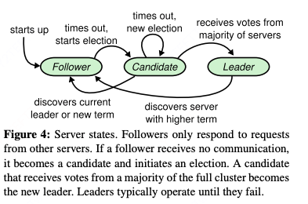
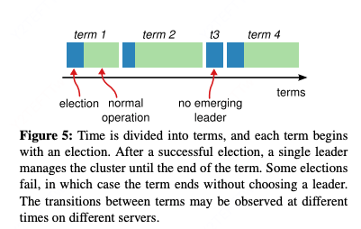

# 摘要

Raft是一种用于管理 replicated log 的共识算法。

他和 Paxos 提供一样的能力，但是 raft 更简单更高效

raft 分离了共识的三要素：leader 选举，日志复制，安全

# 1、Introduction

raft 很简单，学过的人都说好

raft和其他很多共识算法相似，但是有一些新特点

1. 强leader机制：所有log 只由leader 流向 replica，这样省去很多管理成本

2. 选举机制：随机定时器，来简单快速的解决选举冲突

3. 成员变动：Raft’s mechanism for changing the set of servers in the cluster uses a new joint consensus approach where the majorities of two different configurations overlap during transitions. This allows the cluster to continue operating normally during configuration changes.（不太懂）

raft 的安全特性被形式化验证过！

# 2、Replicated state machines

首先，共识算法一般是在 多副本状态机 的情况下所需要。说人话就是，多个机器保持状态（数据）的一致就需要共识算法。

共识算法通常有以下属性

1. 确保安全（不返回错误结果），在任何 非拜占庭将军问题 的情况下，例如各种网络问题

2. 功能完全可用，只需要大多数节点可用&可达即可。例如5 个节点的情况下，可以容忍两个节点崩溃

3. 不依赖时钟同步来保证一致性，时钟问题或者极端延迟只会导致可用性问题。

4. 通常情况下，大部分节点执行完后，服务即可返回，少数慢节点不会对服务产生影响。

# 3、What’s wrong with Paxos?

## 极其难理解

The first drawback is that Paxos is exceptionally difficult to understand.

raft 作者们读了很多简化版理解 & 写出 raft 之后，才理解了paxos，这个过程耗时将近 1 年

## 没有为上层应用构建良好基础

Paxos的第二个问题是它没有为构建实际实现提供良好的基础。

paxos 没有定义具体的多决策实现，导致工程实现中需要填补大量细节。

paxos 架构是 p2p + 单决策优先的。导致决策效率低。

实际上，大部分系统开始的时候以 paxos 作为框架设计，实现过程中发现有很多困难，最后实现了一个和 paxos 大不相同的框架。

## 总结

尽管，paxos 协议有形式化的验证，但是实际中需要的模型和 paxos 大相径庭，导致最终实现的结果于形式化验证过的 paxos 协议不同。所以 paxos 的形式化验证没什么用。

# 4、Designing for understandability

raft 最难的挑战就是让开发者能够轻松理解协议，从而方便开发和扩展。

raft 做了两点努力

1. 将问题分解，in Raft we separated leader election, log replication, safety, and membership changes.

2. 简化状态空间，减少不确定性

# 5、The Raft consensus algorithm

本章以简练的形式描述算法，并列出了算法的一些关键要素。

raft 实现一致性通过选举出一个杰出的 leader，leader 被负责全权管理 log。log 的复制、log 的传递、client 请求如何插入 log等，这大大减少了节点之间的交流，以及管理的复杂度。如果 leader 不可用/不可达，raft 会自动从剩下的节点中选举一个新的 leader。

基于 leader 制度，raft 将**一致性问题**分解为了**三个**相对独立的问题

1. **leader 选举**：leader 挂了则必须立即产生一个新 leader

2. **log 复制**：leader 必须接受 client 请求，并负责 log 在集群中的复制，迫使其他日志与其保持一致

3. **安全**：主要指的是状态机安全，即​**如果某个服务器已将特定日志条目应用到其状态机，其他服务器不能对同一日志索引应用不同的命令**。这一属性确保了所有节点在相同日志索引位置执行的命令完全一致，raft 通过多方面机制实现这一安全性

## Figure2

## Figure3

## 5.1 Raft basics

raft 集群一般有 5 个节点，容忍最多两个节点宕机

集群节点只有三个状态：leader， candidate， follower

任意时刻，集群中只有一个 leader，其余都是 follower

follower 是被动的，只被动处理 leader 发来的消息，client 请求全部由 leader 处理，如果有请求发送到了 follower，则由 follower 转发给 leader。

candidate 是在选举过车中的节点状态，candidate 中会产生一个 leader。

raft将时间分为一个个 Term（任期），任期连续且单调增长

1. 每个 term 开始都是选举阶段

2. 选举成功则进入工作期，选举失败则在短暂等待后进入下一个 term

不同的节点可能会在不同时刻观察到 term 的转变，某些情况下，部分节点可能不会察觉到 term 转变，甚至完全不知道某个 term 的存在（乃不知有汉）。

Term 在 raft 中充当一个逻辑时钟的作用，它让节点能发现一些过时的信息，例如过时的 leader。

节点记录的 Term 会在节点通信时改变：

1. 通信时发现更新的 Term，则节点改变自己的 Term 为最新

2. 若 candidate 或者 leader 发现一个更新的 Term，则立刻转为 Follower

3. 如果收到一个过期 Term 的请求，则拒绝请求

raft 通信通过 RPC，基础的 raft 只有两种 RPC 请求

1. RequestVote RPC：由 candidate 在选举期间发送

2. AppendEntries RPC：由 leader 发送 log 给 follower，同时也用于leader 心跳

第七章会增加一个新的 RPC，用于在节点间传输 snapshots

RPC 有**超时重试**机制，RPC Call 是**异步执**行的。

## 5.2 Leader election

raft 通过心跳机制来触发选举，节点启动时都是 follower，并启动心跳检测机制，一段时间内没有收到来自 leader or candidate 的请求则转为 candidate 并发起选举。

Leader 则会在任期内，周期性的发送心跳来维持自己的权威。

**开启选举后**，follower 会增加其 currentTerm，并转为 Candidate 。为自己投一票后，同时向所有其他节点发送 RequestVote RPC。candidate 会在以下三种情况中结束选举：

1. 赢得选举，转为 leader

2. 某个其他节点成为 leader，转为 follower

3. 没人赢得选举，转为 follower

接下来详细介绍这三种情况

### 赢得选举

在同一个 Term 内的选举过程中获得大多数选票的情况下会赢得选举。

大多数 = 超过半数（包括宕机的节点）

每个节点在一个 Term 中最多投一票，再加上先来先服务的原则，“大多数”原则能确保一个 Term 中最多只有一个 leader 当选（这也保证了选举安全性，Figure3 中的第一个点）

### 发现其他 leader

在等待投票过程中，candidate 可能会收到其他自称 leader 节点的 AppendEntries 请求，如果这个 leader 的 term 大于等于 candidate 的 currentTerm，那么 candidate 认可这个 leader 并结束选举，转为 follower。否则拒绝该 请求并继续选举

### 无人赢得选举

票型分散，导致没有一个 candidate 获得超过半数的投票，则选举失败

此时，candidate 会进入下一个 election timeout 周期。

理论上来说，这种情况可能会重复的发生，导致一直没有 leader 的状况（活锁），从而导致服务不可用（需要一定的机制来尽量避免这个问题）

### 随机选举周期

**预防分票**

raft 节点的 election timeout 周期每次都是随机的，从而减少节点们同时成为 candidate 的概率，从而降低分票发生的概率。

election timeout 是 150ms - 300ms 之间的随机数

同样的机制也被用于解决分票问题

**处理分票**

每个候选人在选举开始时重新启动其随机选举超时计时器，并等待该超时结束后再发起下一次选举；这降低了新选举中再次出现选票分裂的可能性。

### 可理解性

在设计选举算法中，作者让算法可理解性主导算法的设计。

一开始，作者打算给每个节点一个随机rank，用于解决分票问题，分票产生时，rank 低的 candidate 自动退出选举。从而解决分票问题。

但这个机制引来了其他的一些小问题，作者多次调整算法，发现总是有各种小问题。

最后选择了随机timeout + 重试的机制，这样最简单也好理解。
