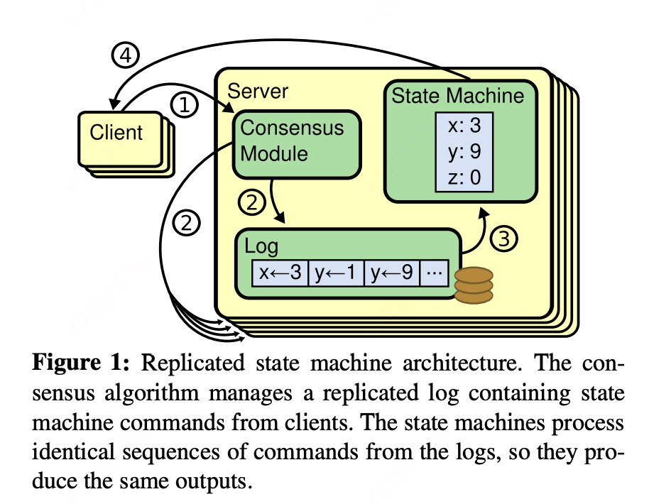
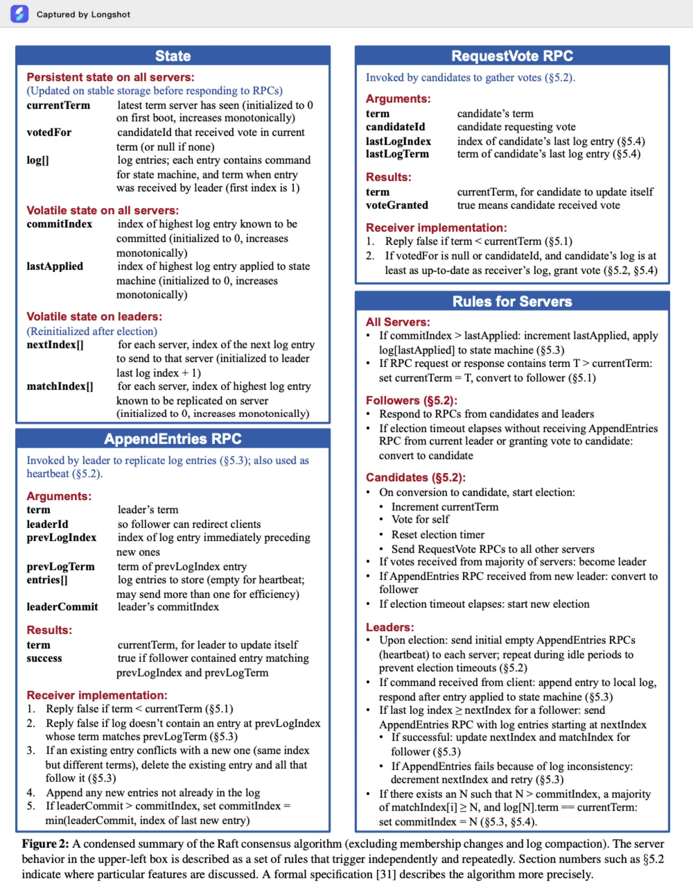
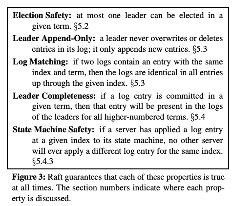

# 摘要

Raft是一种用于管理 replicated log 的共识算法。

他和 Paxos 提供一样的能力，但是 raft 更简单更高效

raft 分离了共识的三要素：leader 选举，日志复制，安全

# 1、Introduction

raft 很简单，学过的人都说好

raft和其他很多共识算法相似，但是有一些新特点

1. 强leader机制：所有log 只由leader 流向 replica，这样省去很多管理成本

2. 选举机制：随机定时器，来简单快速的解决选举冲突

3. 成员变动：Raft’s mechanism for changing the set of servers in the cluster uses a new joint consensus approach where the majorities of two different configurations overlap during transitions. This allows the cluster to continue operating normally during configuration changes.（不太懂）

raft 的安全特性被形式化验证过！

# 2、Replicated state machines

首先，共识算法一般是在 多副本状态机 的情况下所需要。说人话就是，多个机器保持状态（数据）的一致就需要共识算法。

共识算法通常有以下属性

1. 确保安全（不返回错误结果），在任何 非拜占庭将军问题 的情况下，例如各种网络问题

2. 功能完全可用，只需要大多数节点可用&可达即可。例如5 个节点的情况下，可以容忍两个节点崩溃

3. 不依赖时钟同步来保证一致性，时钟问题或者极端延迟只会导致可用性问题。

4. 通常情况下，大部分节点执行完后，服务即可返回，少数慢节点不会对服务产生影响。

# 3、What’s wrong with Paxos?

## 极其难理解

The first drawback is that Paxos is exceptionally difficult to understand.

raft 作者们读了很多简化版理解 & 写出 raft 之后，才理解了paxos，这个过程耗时将近 1 年

## 没有为上层应用构建良好基础

Paxos的第二个问题是它没有为构建实际实现提供良好的基础。

paxos 没有定义具体的多决策实现，导致工程实现中需要填补大量细节。

paxos 架构是 p2p + 单决策优先的。导致决策效率低。

实际上，大部分系统开始的时候以 paxos 作为框架设计，实现过程中发现有很多困难，最后实现了一个和 paxos 大不相同的框架。

## 总结

尽管，paxos 协议有形式化的验证，但是实际中需要的模型和 paxos 大相径庭，导致最终实现的结果于形式化验证过的 paxos 协议不同。所以 paxos 的形式化验证没什么用。

# 4、Designing for understandability

raft 最难的挑战就是让开发者能够轻松理解协议，从而方便开发和扩展。

raft 做了两点努力

1. 将问题分解，in Raft we separated leader election, log replication, safety, and membership changes.

2. 简化状态空间，减少不确定性

# 5、The Raft consensus algorithm

本章以简练的形式描述算法，并列出了算法的一些关键要素。

raft 实现一致性通过选举出一个杰出的 leader，leader 被负责全权管理 log。log 的复制、log 的传递、client 请求如何插入 log等，这大大减少了节点之间的交流，以及管理的复杂度。如果 leader 不可用/不可达，raft 会自动从剩下的节点中选举一个新的 leader。

基于 leader 制度，raft 将**一致性问题**分解为了**三个**相对独立的问题

1. **leader 选举**：leader 挂了则必须立即产生一个新 leader

2. **log 复制**：leader 必须接受 client 请求，并负责 log 在集群中的复制，迫使其他日志与其保持一致

3. **安全**：主要指的是状态机安全，即​**如果某个服务器已将特定日志条目应用到其状态机，其他服务器不能对同一日志索引应用不同的命令**。这一属性确保了所有节点在相同日志索引位置执行的命令完全一致，raft 通过多方面机制实现这一安全性

## Figure2

## Figure3

