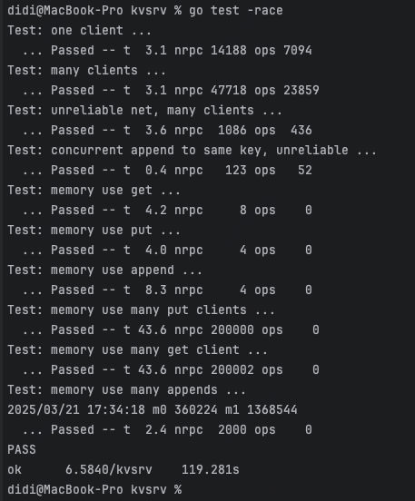

# Key/Value Server

环境：单机

操作语义：exactly-once

一致性要求：可线性化（Linearizable）


### Key/value server with no network failures ([easy](http://nil.csail.mit.edu/6.5840/2024/labs/guidance.html))

很简单，锁住对于map的操作就行了。


### Key/value server with dropped messages ([easy](http://nil.csail.mit.edu/6.5840/2024/labs/guidance.html))

**需要考虑几个问题：**

1. 网络差，req或者resp可能会丢失

2. 保证命令被server执行

3. 保证put，append不会重复执行

4. get请求在重试的过程中，保证返回的时第一次get请求时应该获得的值

5. 控制server的内存


**解决方案：**

- client循环请求，直到请求成功 （解决问题1，2）

- server记录每个请求的执行结果和请求id，根据id判断重复请求，防止重复执行同一请求（解决问题3，4）

- client收到server的response后，向server发送确认信息，server将对应缓存删掉，防止内存爆了（解决问题 5）


# 核心代码

### server内存结构

```go
type KVServer struct {
	// 两个锁，分别锁kv存储 和 请求cache，这样粒度更细，并发效率更高
	mu sync.Mutex
	logMu sync.Mutex

	// kv 存储
	m map[string]string

	// 缓存请求结果，避免重复请求
	// key 为clientId，（由于单个client的单线程请求模型，一个新的请求到来，表明client已经收到前面的请求的回复
	// value 为请求日志，包含返回值和请求id
	requestLog map[int64]RequestLog
}
```


### client请求逻辑

```go
func (ck *Clerk) Get(key string) string {
	server := ck.server
	args := GetArgs{key, &BaseArgs{ck.id, nrand(), GET}}
	reply := GetReply{""}

	// 循环到成功为止
	for !server.Call("KVServer.Get", &args, &reply) {
	}

	// 确认收到response
	args.BaseArgs.RequestType = DONE
	doneArgs := DoneArgs{args.BaseArgs}
	for !server.Call("KVServer.Done", &doneArgs, &DoneReply{}) {
	}

	return reply.Value
}
```


### server处理逻辑

```go
// 处理请求前，先检查是否为重复请求
func (kv *KVServer) checkDuplicatedRequest(baseArgs *BaseArgs) (dup bool, ans string) {
	clientId := baseArgs.ClientId
	requestId := baseArgs.RequestId

	kv.logMu.Lock()
	log, exists := kv.requestLog[clientId]
	kv.logMu.Unlock()

	if exists && log.requestId == requestId {
		return true, log.responseValue
	} else {
		return false, ""
	}
}


// 处理完请求后，将请求的相关信息缓存
func (kv *KVServer) createRequestCache(baseArgs *BaseArgs, responseValue string) {
	kv.logMu.Lock()
	defer kv.logMu.Unlock()
	kv.requestLog[baseArgs.ClientId] = RequestLog{baseArgs.RequestId, responseValue}
}


func (kv *KVServer) Get(args *GetArgs, reply *GetReply) {
	dup, ans := kv.checkDuplicatedRequest(args.BaseArgs)
	if dup {
		reply.Value = ans
		return
	}

	key := args.Key
	kv.mu.Lock()
	defer kv.mu.Unlock()
	value, ok := kv.m[key]
	if ok {
		reply.Value = value
	} else {
		reply.Value = ""
	}

	kv.createRequestCache(args.BaseArgs, reply.Value)
}
```


完成截图


