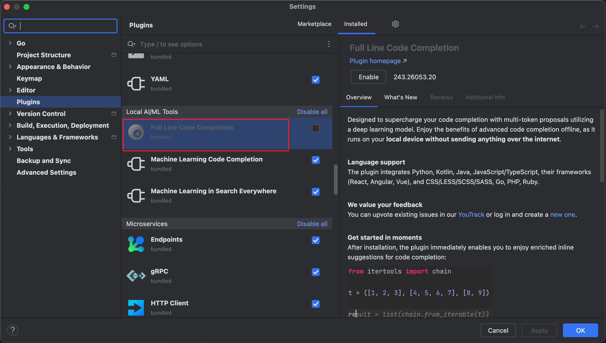

# Lab3: Raft

在接下来一系列的 lab 中会构造一个有容错的 kv 存储系统

本lab 会实现 raft，一个复制状态机协议

下一个 lab 在此基础上实现 kv 服务，然后在服务上分片，来提升性能

一个复制状态 服务通过 节点间状态的完全复制 来实现容灾，复制使得在部分节点宕机或者网络差的情况下服务仍能继续，但难点在于节点宕机/网络问题会导致节点间状态不一致，如何恢复到一致？

**raft 大致工作原理**

将 client 请求组织为一个序列——log，确保所有 replica 有同样的 log。所有 replica 按序执行 log，并更新自己的状态。

如果有宕机，raft 会在其上线后恢复其 log 为最新状态。

只要多数机器在线且互相能通信，raft 就能正常工作，否则，raft 会停止服务，并等待多数机器在线且互相能通信，raft 才继续提供服务。

### Part 3A: leader election

如果是用 goland 来写，需要把这个内置插件关了，因为它完全知道该怎么写 hhh，和抄答案没什么区别hhhh。

回到正文：

本 part 需要实现 leader 选举和心跳机制

心跳机制通过没有 log 数据的 AppendEntries 实现

目标：能选取一个 leader，没有错误的情况下能连任，出错了或者不可达了则选出新的 leader。

