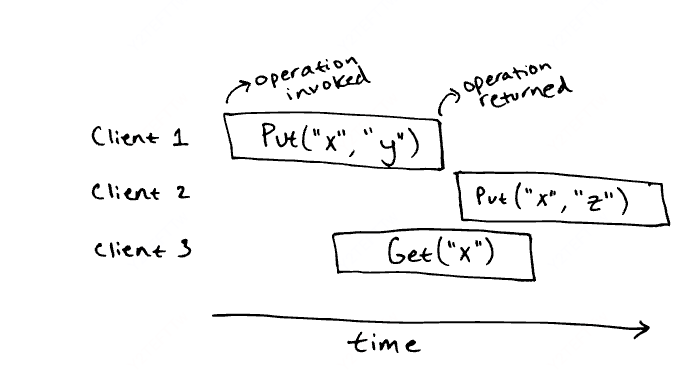

# 如何测试分布式系统是否可线性化

分布式系统测试非常难，因为网络的存在，可能延迟，重复，乱序，丢包；节点随时可能崩溃，即便设计上证明了系统的无误，但也很难避免实际中的小 bug。

除非使用**形式化方法验证**，我们必须要测试实现的正确性。

测试分布式系统很有挑战性，并发&不确定性导致 bug 难以复现和定位，尤其是很少见的 特定情况下的偶发 bug，例如节点同时崩溃或者极端网络延迟。

--- 

## 正确性

何为“正确”

即便是看起来很简单的系统，要精确说明其**预期行为**也是一个复杂的过程。

考虑一个简单的 kv 存储系统，只有两个操作

1. put(k, v)

2. get(k)

### 串行场景下

```python
class KVStore:
    def __init__(self):
        self._data = {}

    def put(self, key, value):
        self._data[key] = value

    def get(self, key):
        return self._data.get(key, "")
```

串行场景下的 kv 存储很简单，程序员会对其有很直观的预期

### 可线性化场景

与串行化不同，对程序的预期会产生分歧



考虑如上情况，get（x) 应该返回什么是不确定的，可能是 y，可能是 z，甚至可能为空

但如果 get（x）在所有操作之后执行，且完全没有产生并发，那么预期又变得明确了，

get（x）应该返回 z

我们会采用 线性一致性（**linearizability**）的模型来形式化定义并发操作的正确性

## 测试

不用形式化方法验证程序绝对正确

那么如何用测试来确保程序正确性？

可以尽可能的模拟一切操作，一切网络状况，一切意外情况，并测试足够多的次数，从而确保程序在大部分情况下是正确的。

### Ad-hoc testing

随机测试：非结构化的软件测试方法，强调**无预先计划的、探索性的测试执行**

例如可以用如下方式测试 kv 存储是否是可线性化的

```text
for client_id = 0..10 {
    spawn thread {
        for i = 0..1000 {
            value = rand()
            kvstore.put(client_id, value)
            assert(kvstore.get(client_id) == value)
        }
    }
}
wait for threads
```

如果测试未通过，则kv 存储一定不是可线性化的

但如果通过，也不能保证kv 存储一定是可线性化的

### 线性一致性测试

如何测试分布式系统是否为可线性化

由于无法只通过结果来判断系统是否是可线性化的

所以通过记录整个历史来判断某次测试是否符合**线性一致性**

但是！线性一致性检查是一个 NP完全问题

可以将**子数组和**问题转化为**线性一致性检测**问题

转化过程见：[转化](https://anishathalye.com/testing-distributed-systems-for-linearizability/#user-content-fn-specs-for-real-systemshttps://anishathalye.com/testing-distributed-systems-for-linearizability/#user-content-fn-specs-for-real-systems)

### 实现

尽管线性一致性检查是NP完全问题，但在实践中，它对于小型历史记录可以很好地工作。线性一致性检查器的实现会接收一个执行序列和历史记录，然后运行搜索程序尝试构建线性化，同时采用各种技巧来限制搜索空间的规模。

## 有效性

Testing linearizable distributed systems using fault injection along with linearizability checking is an effective approach.

线下一致性测试更有效

该文章作者分别用 ad-hoc 和 线下一致性测试 测试了自己的 kv 存储

ad-hoc 能捕获一些严重的 bug，但是一些小 bug 就不行

线性一致性测试能捕获所有的 bug，**作者如何尝试都没法写一个线性一致性测不出来的 bug**
