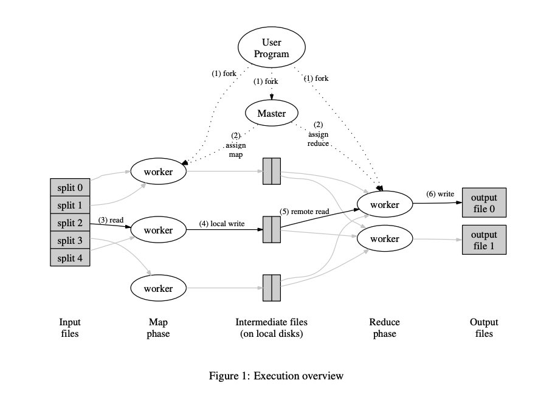
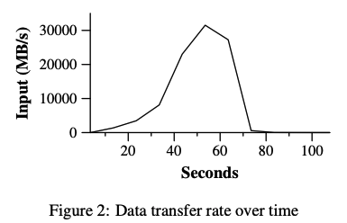
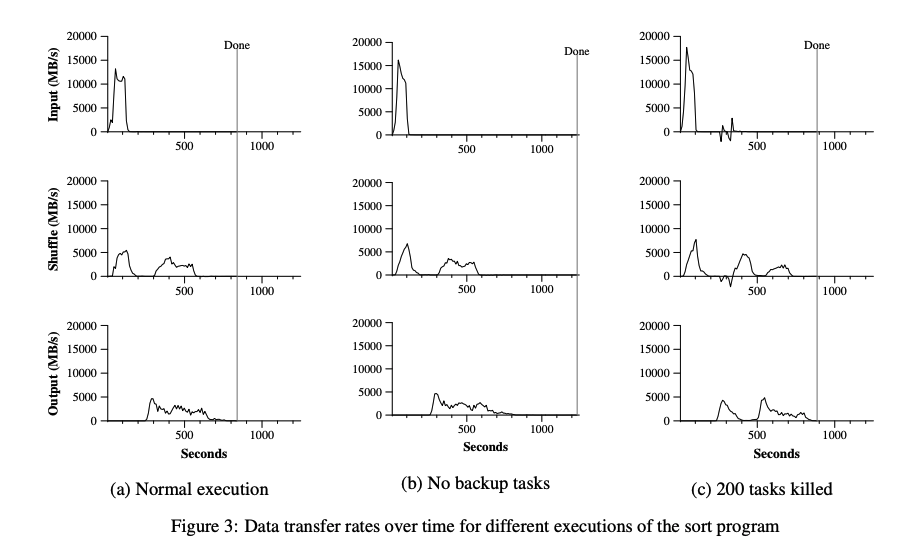
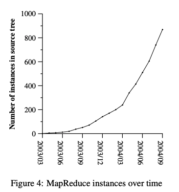
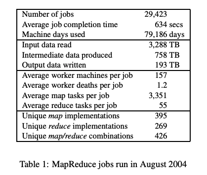

# MapReduce

简化大集群上的数据处理

---

## 摘要

MapReduce（MR）是一种编程模型 & 其相关的实现。MR能处理&生成大数据集，用户只需要定义 Map 方法来处理数据并生成 K/V 中间数据，还需要定义一个Reduce方法，来合并所有的中间结果。现实世界中的很多任务都可以用 Map/reduce 这种方式来执行，下文会举例。

是谷歌公司提出的

## 1、Introduction

过去5年，google实现了很多特殊的计算过程，网页请求日志，倒排索引，最频繁请求集。这些都是看起来很好理解的问题，但是由于数据量过于巨大，完全无法单机完成，必须在多台机子上并行计算，才能在可接受的时间内完成计算。但是，如何分配计算，如何处理节点故障，使得原本在单机上解决这些问题的简单的代码，变得非常复杂。

MR让用户只用实现 Map 和 Reduce 即可，完全屏蔽了底层和分布式相关的细节。该模型使得大型计算很容易并行执行。该模型主要通过re-execution 来实现 fault tolerance

文章的2 - 7部分分别阐述了以下内容

- 第二部分：描述了MR的基本模型，举了几个例子
- 第三部分：描述了一个MR的实现
- 第四部分：描述了一些对于MR的很有用的优化
- 第五部分：性能测试相关
- 第六部分：探讨了google内部使用mapreduce的经验
- 第七部分：讨论了相关的和未来的工作

## 2、Programming Model

整个计算流程以一系列键值对作为输入，输出一系列键值对。MR的调用者只需要定义Map和Reduce即可

Map：接受一对值为输入（例如<文件名，文件内容>），输出一系列键值对（例如 <单词，出现次数>）, MR会整合所有map的结果，并将key相同的键值对打包为一个reduce任务的输入。

Reduce：接收一个key，以及和这个key相关的values。将这些values融合为一个更小的values集，一般来说只会输出一个或0个value。这些values通过迭代器提供给reduce，以免values列表太大，内存容不下

### 2.1 Example

考虑word-count问题，用户会写类似如下的伪代码

```go
map (String key, String value) {
        // key: document name
        // value: document contents
        for each word w in value:
                EmitIntermediate(w, "1");
}

reduce (String key, Iterator values) {
        // key: a word
        // values: a list of counts
        int result = 0;
        for each v in values:
                result += ParseInt(v);
        Emit(AsString(result));
}
```

map输出<单词， 计数>的键值对（这个简单的例子中计数为1，也就是遇到一个单词就输出一个键值对，而不进行累加）

reduce统计特定单词的计数，并输出计数

除此之外，用户还要在代码里写和输入输出文件名相关的信息，还有一些可选的调优参数。

> the user writes code to fill in a mapreduce specification object with the names of the input and output files, and optional tuning parameters. The user then invokes the MapReduce function, passing it the specification object.
> 
> （引用原文是因为没看懂）

### 2.2 Types

从概念上来说，map和reduce的输入输出类型是相关联的

例如：map输入和reduce输出的KV是不同类型，但是中间结果（map的输出）和reduce输出的KV是同类型 

> Even though the previous pseudo-code is written in terms of string inputs and outputs, conceptually the map and reduce functions supplied by the user have associated types
> 
> I.e., the input keys and values are drawn from a different domain than the output keys and values. Furthermore, the intermediate keys and values are from the same domain as the output keys and values.

### 2.3 More Examples

这里有些程序可以和轻松的转变为MR的模式来执行

**分布式正则匹配**

map将与模式匹配的文本行输出，reduce仅做恒等变换将map产生的结果输出即可。

**URL访问评率计数**

map处理请求日志，并输出< url , 1 >，reduce接收同一个键的所有中间结果，并统计输出 < url , total_count >

**反向网络链接图：**

映射（map）函数针对在名为 “源（source）” 的页面中发现的指向目标 URL 的每个链接，输出形如 < target, source> 这样的键值对。

化简（reduce）函数会将与给定目标 URL 相关联的所有源 URL 的列表进行拼接，然后输出形如 <target，list(source)> 这样的键值对。

**每主机词向量:**

> 词向量(term-vector)是一种总结文档或一组文档中最重要的单词的方法，它以 <单词，频率> 对的列表形式呈现。例如，如果一个文档中有单词 “apple” 出现了 3 次，“banana” 出现了 2 次，那么这个文档的词向量可能是 list [< apple, 3 > , < banana, 2>]

对于每个输入文档，map 会输出一个 <主机名，词向量> 对。主机名是从文档的 URL 中提取出来的。

reduce接收给定主机的所有词向量。它将这些词向量相加，去除不频繁的词（可能是根据一定的频率阈值来判断），然后输出一个最终的 <主机名，词向量> 对。

**倒排索引：**

map读取文件，输出< 单词，文件id >, reduce手机统一单词的所有kv，排序文件id，输出 < 单词， list(文件id) >

**分布式排序：**

> The map function extracts the key from each record, and emits a <key, record> pair. The reduce function emits all pairs unchanged. This computation depends on the partitioning facilities described in Section 4.1 and the ordering properties described in Section 4.2.

## 3、Implementation

MR有很多种实现，选择何种实现取决于不同的环境。比如说：

1. 有的实现适合小型共享内存的机器
2. 有的实现适合大型NUMA多处理器
3. 有的适合更大的联网机器集合

本节讨论的一种实现，它适用于通过交换式以太网连接的大型商用PC集群，这种环境在Google公司里很广泛使用。

这种环境下

1. 机器通常是运行在2-4GB的内存上，双核x86处理器，Linux操作系统
2. 使用商用的网络硬件，通常是 100Mb/s 或者 1Gb/s 级别的，但在整体二分带宽上平均要少得多
3. 一个集群中有成百上千的机器，所以宕机很常见
4. 存储使用的是廉价的IDE磁盘，并且直接连接在每个一机器上，会有一个分布式文件管理系统来管理这些数据，这个文件系统通过副本机制，从而在不可靠的硬件上供可用性和可靠性
5. 用户将工作提交给调度系统，每个工作有一系列任务组成，并由调度系统映射到集群内的一组可用机器

---

### 3.1 Execution Overview



Map阶段被分配到多台机器并行执行，每个机器接受一个map任务。MR的输入数据切分为M片，每个map任务获取一片，所有map任务并行处理。

Reduce阶段也类似，将map阶段产生的中间结果分为R片。

Figure1（原文的图一）展示了MR的整个流程，当用户程序调用MR后，MR会有如下行为（标号对应Figure1中的标号）

1. MR将输入文件分为M块，通常16MB - 64MB每块。然后启动集群，并执行同一个MR程序
2. 集群中只有一个机器执行不同的程序，Master机器，剩余的机器都是Worker，由master安排任务。共有M个map任务和R个reduce任务。Mater选择空闲的worker来安排任务
3. worker执行map任务时，它从输入的数据片读取内容，并解析出kv传递给用户定义的map函数，map函数产生的中间结果缓存在内存中
4. 在内存中缓存的kv会周期性的写入本地磁盘，通过分割方法，分别写入R个区域。这些pair在磁盘上的位置会传回给master，master负责将这些位置信息传给reduce worker
5. When a reduce worker is notified by the master about these locations, it uses remote procedure calls to read the buffered data from the local disks of the map workers. When a reduce worker has read all intermediate data, it sorts it by the intermediate keys so that all occurrences of the same key are grouped together. The sorting is needed because typically many different keys map to the same reduce task. If the amount of intermediate data is too large to fit in memory, an external sort is used.
6. reduce worker 遍历排序好的中间数据，对于不同的中间key，worker将这个key和所有对应的value传给Reduce函数，Reduce函数的输出会拼接到一个最终输出文件
7. 当所有的mapreduce任务结束，master唤醒用户程序。

完成后，MR的执行结果在R个输出文件中。通常，用户不需要将R份输出文件整成一个，而是将其作为一个新的MR任务的输入数据，或者用作另一个分布式应用的输入。

### 3.2 Master Data Structures

master保存一些数据结构，对于每个map和reduce任务，master存储其状态（空闲，运行中，完成），以及正在执行该任务的机器id

master充当一个通道，通过他，中间文件的位置信息能从map任务传递到reduce任务。因此，对于每个完成的map任务，master存储其文件位置和文件大小。这些信息推送给正在干活的reduce worker

### 3.3 Fault Tolerance

上千台机器干活，必须优雅的容错

**Worker Failure**

master周期的ping 所有worker，一段时间没回应的worker会被认为宕机了。宕机机器的所有相关任务重置为空闲状态（即便是已经完成的任务），供其他worker做。

为什么宕机worker上已经完成的map任务也要重新执行呢？因为map的输出是在本地磁盘上，worker宕机了，输出也就获取不到了。

已经完成的reduce任务不需要再执行了，因为reduce任务的输出在GFS中。

当一个map 任务先被worker A执行了又被worker B执行了，所有reduce worker会注意到这个重复执行。任何reduce 任务 还没有从A读数据的会从B读数据

MR是能容忍大面积宕机。例如，某种原因导致80台机子几分钟内无法访问，MR只需要将这些机子上的任务分配给其他的机子重新执行即可，最终完成任务

**Master Failure**

可以让master周期性的将自己的数据结构（状态）写出，这样当一个master死了，可以重启一个master读入最新的状态并执行。

然而，鉴于只有一个master节点，宕机的可能性也不大。因此，我们的实现中不考虑master宕机情况，如果master真死了，直接重启整个MR任务吧。

**Semantics in the Presence of Failures** （失败存在下的语义学？）

当用户提供的映射（map）和化简（reduce）操作符对于它们的输入值而言是确定性函数时，我们的分布式实现所产生的输出，与在无故障情况下对整个程序进行顺序执行所产生的输出是相同的。 

我们依靠map和reduce任务提交数据的原子性来实现这一特性。每个任务将其输出写入本地文件中。当一个map任务完成，worker向master发送信息（包含输出文件的名字）。如果master收到多份map任务完成的信息，以第一个提交信息为准，后面的都忽略。master将map的输出文件名存入master的数据结构中。

当一个reudce任务完成时，reduce worker自动将临时输出文件重命名，作为最终输出文件。如果同一个化简（Reduce）任务在多台机器上执行，那么针对同一个最终输出文件，就会执行多次重命名（rename）调用。我们依靠底层文件系统所提供的原子重命名操作，来确保最终的文件系统状态中仅包含由一次 Reduce 任务执行所产生的数据。

我们绝大多数的映射（map）和化简（reduce）操作符都是确定性的，并且在这种情况下，我们的语义等同于顺序执行这一事实，使得程序员能够非常轻松地推断其程序的行为。当映射（map）和 / 或化简（reduce）操作符是非确定性的时候，我们会提供相对较弱但仍然合理的语义。

> In the presence of non-deterministic operators, the output of a particular reduce task R1 is equivalent to the output for R1 produced by a sequential execution of the non-deterministic program. However, the output for a different reduce task R2 may correspond to the output for R2 produced by a different sequential execution of the non-deterministic program.
> 
> ps：不太懂这一段，大概就是说MR计算结果的确定性和用户定义的map reduce函数的确定性有关。

### 3.4 Locality

网络带宽在我们的计算环境中是相对稀缺的资源。我们利用输入数据本地存储的特点，来节省带宽。GFS将每个文件分为多个64MB的块，每个块存储多份拷贝（通常是三份拷贝）在不同机器上。master会尝试将map任务分配给本地有对应数据的worker，这样就不用传输数据了，或者分配给靠近数据存储位置的worker（例如和数据存储在同一个局域网中的worker）。当在集群中相当一部分工作节点上运行大规模的 MapReduce 操作时，大部分输入数据是在本地读取的，不会占用网络带宽。

### 3.5 Task Granularity（任务粒度）

上文中，我们将map阶段分为M个任务，reduce阶段R个任务。理想情况下，R和M应该比worker数大很多，这样有助于负载均衡。并且有利于宕机恢复，因为这个宕机的worker的任务可以被分配给更多的机器。

由于master必须花费 

O( M + R ) 的时间复杂度去进行调度决策

O (M * R) 的空间复杂度来存储状态 （为什么！！！）

所以在我们的实现中，M 和 R 的大小是有实际界限的

此外，R通常受到用户的限制，因为每个reduce都会输出一个文件，文件数量的增多可能导致文件系统性能下降。实际上，我们倾向于选择M的大小使得每个 map 任务的输入数据大小在 16MB - 64MB之间（有助于发挥3.4提到的局部性的优势），当 M 过分大时，会导致map任务的输入数据很小，会导致频繁的磁盘或者网络IO操作。

### 3.6 Backup Tasks

会导致MR的总执行时间变长的一个常见的原因是：straggler（拖后腿者）。即一台花费异常长时间来完成最后几个任务的机器。有很多原因会导致“straggler”。例如：

1. 一个磁盘不好的机器可能会读写很慢
2. 集群调度系统可能在某些机子上安排了其他任务，导致Mapreduce被分配的计算、存储、网络资源很少，从而执行很慢

我们有一个通用的机制来缓解“拖后腿者”的问题，当一个MR操作快结束的时候，master会对剩余正在进行的任务安排备份执行。只要主执行或备份执行中的任何一个完成，该任务就会被标记为已完成。我们对这个机制进行过调优，使得它最多只增加额外几个百分点的资源占用。我们还发现这个机制能显著的减少大型MR操作。例如，排序（5.3会提到）如果不用这个机制，会慢44%！

## 4、Refinements（优化）

尽管仅通过编写映射（Map）和归约（Reduce）函数所提供的基本功能能满足大多数需求，但我们发现一些扩展功能也很有用。本节将对这些扩展功能进行介绍。

### 4.1 Partitioning Function（分区函数）

MapReduce 的用户会指定他们期望的 Reduce 任务数量，也就是输出文件的数量（用 R 表示）。

数据会根据中间键（intermediate key），利用一种分区函数在这些 Reduce 任务间进行划分。这意味着数据不是随机分配给 Reduce 任务的，而是依据键的特性进行合理分配，以确保每个 Reduce 任务处理的数据具有一定的逻辑关联性。默认的分区函数 - 哈希算法（例如 “hash (key) mod R”），分区效果挺好，挺平均。

但并不是所有情况下用hash都可以，例如key是一些URL，用户想将同一个主机名放在一个文件内。

这时候通过实现MR库中的Partitioning Function来实现。例如，hash(hostname(key)) mod R，就可以将同主机名的key最后输出到同一个文件中。

### 4.2 Ordering Guarantees

给定分区函数，我们确保键值对的处理顺序是增序的，这样使得生成的文件也是排好序的。方便了用户的后续使用。

### 4.3 Combiner Function

用户可以选择实现 Combiner Function 使得MR变快

有些时候，map会产生非常多的重复的键值对。

例如，word-count，每个map任务都会生成大量的 <the, 1> 键值对，这些都会被通过网络送给一个reduce任务。

用户实现 Combiner Function，可以在map的过程中就将这些重复的键值对聚合为一个，以大大提高效率。

Combiner Function和 reduce function基本是一样的，唯一不同就是如何处理这两者的输出。reduce function输出直接到一个最终文件中，combiner function的输出和map function的输出一样输出到中间文件中

combiner function对于特定问题的性能提升是显著的

### 4.4 Input and Output Types

MR 库支持读取几种不同格式的输入。例如，text类型的输入，会按照<行号，行内容>来读取并传递给map function

用户可以自己来实现 reader接口，从而按照自己想要的方式读取输入。

reader 不一定要从文件中读取数据。你可以很容易的定义一个reader从数据库中读数据，或者从内存中读数据。

相似的，对于输出的处理也有不同的支持，用户也可以自定义。

### 4.5 Side-effects

在某些情况下，MapReduce 的用户发现在其 Map 和 / 或 Reduce 操作中生成辅助文件作为额外输出很方便。这意味着用户除了获得常规的 MapReduce 输出结果外，还能创建一些辅助性的数据文件。例如，在处理日志数据时，用户可能希望在生成汇总统计结果的同时，创建一个包含特定异常记录的辅助文件，方便后续深入分析。

但是，用户编写逻辑生成这些辅助文件的同时，需要确保文件生成具有原子性（要么成功生成要么什么都不生成）和幂等性（多次执行结果相同）。

> We do not provide support for atomic two-phase commits of multiple output files produced by a single task. Therefore, tasks that produce multiple output files with cross-file consistency requirements should be deterministic. This restriction has never been an issue in practice.
> 
> 不太懂，大概意思是，一个任务生成多个文件的话，是不保证原子性的。用户需要自己想办法。但实际上，这并没有成为问题。

### 4.6 Skipping Bad Records

有时候，用户的代码有bug，遇到一些特定的数据的时候，100%挂。这导致MR无法完成。

一般来说，都是用户自己去改bug，但是有时候不可行，因为可能是三方库中的bug。

有的时候，忽略一些数据，对于结果没有太大影响。所以我们提供可选择的模式，在该模式下，MR会自动检测到导致程序卡住的数据，并且跳过他。

> Each worker process installs a signal handler that catches segmentation violations and bus errors. Before invoking a user Map or Reduce operation, the MapReduce library stores the sequence number of the argument in a global variable. If the user code generates a signal, the signal handler sends a “last gasp” UDP packet that contains the sequence number to the MapReduce master. When the master has seen more than one failure on a particular record, it indicates that the record should be skipped when it issues the next re-execution of the corresponding Map or Reduce task.
> 
> 这是具体怎么跳过的

### 4.7 Local Execution

MR的debug非常困难，因为是分布式的，切任务的分配不是每次都相同的。

我们也实现了单机版的MR，你可以换到单机上来debug

### 4.8 Status Information

master内部运行一个HTTP服务，会输出MR运行时的状态信息，例如，多少任务完成了，输入总量，输出总量，日志连接，……

用户可以通过这些信息更好的把握MR的执行过程，而不是干等着

### 4.9 Counters

MR库提供了一个 counter facility 来记录一些事件的发生次数。例如，用户想知道有多少单词被处理了，或者有多少德语文件被建立索引了。

如下是 counter facility的使用方式

```golang
Counter* uppercase;
uppercase = GetCounter("uppercase");

map(String name, String contents):
    for each word w in contents:
        if (IsCapitalized(w)):
            uppercase->Increment();
        EmitIntermediate(w, "1");
```

worker产生的计数值会周期性的发送给master（数据直接附在对于master的ping响应中）

master统计所有的counter value。同时会在master status page（4.8）上显示。master保证统计正确，自动过滤重复计数（重复计数在备份执行（3.6）和 重新执行（3.3）时会发生）

MR库会自动保存一些 counter value，例如处理的键值对总数/输出的键值对总数

## 5、Performance（性能）

这节，我们测量两个MR计算的性能，两个计算都在大集群上运行。

1. 从1TB左右的数据中找一个pattern （Grep）
2. 对1TB左右的数据排序 （Sort）

这两个问题都是MR实际应用中的两大类问题的代表，用户经常会编写如下两类问题

1. 将一堆数据从一种表示形式转换为另一种表示形式
2. 从一堆数据中提取少量感兴趣的数据

---

### 5.1 Cluster Configuration

1600台机子，两级树形交换网络，4GB内存，2GHz Intel Xeon with HyperThreading, 160GBIDE disks，1Gb网速。

### 5.2 Grep

grep扫描10^10 个 100字节记录，寻找一个三字符的pattern（这个pattern在所有记录中共出现了92337次），输入被划分为64MB每块，所以 M = 15000，输出放在一个文件即可，所以 R = 1



figure2 展示了输入数据速率随时间的变化，开始时，随着越来越多的机器被分配任务，输入数据的速率持续增长。map阶段完成，输入数据的速率开始下降。整个过程大概150秒，包括1分钟左右的启动开销，启动开销主要源于两方面。一方面是将程序传播到所有工作机器上，这涉及到网络传输，将 MapReduce 程序代码分发到各个计算节点。另一方面，与 Google 文件系统（GFS）交互时存在延迟，包括打开 1000 个输入文件以及获取用于本地化优化所需的信息。本地化优化通常是为了将数据处理任务分配到距离数据存储位置较近的计算节点上，以减少数据传输开销，但这一过程会带来额外的延迟。

### 5.3 Sort

没看懂它怎么排序的。。。



### 5.4 Effect of Backup Tasks

排序测试中，不用backup task的情况下多花了44%的时间。

figure3(b)就是没有backup task的情况，可以看出和 a 的图形很接近，但是b有一个很长很细的尾巴，因为有少数几个worker在拖后腿

### 5.5 Machine Failures

figure3(c)中，展示的是有200个宕机（其实机器还活着，只是进程被杀了）情况下的性能。计算开始的几分钟后，故意杀死200个工作进程。底层的集群调度系统，很快重启了这些任务。

worker进程的死亡在图像上显示为输入速率的负增长，因为有些已经完成的map任务消失了。

在有宕机的情况下，完成的总时间只慢了5%

## 6、Experience

2003年2月，mapreduce的第一个版本

2003年8月，mapreduce完成巨大优化，包括本地性优化、动态负载均衡……

并且发现mapreduce可应用的范围很广，很多google的问题都能用这个模型来计算，包括：

- 大规模机器学习问题
- google新闻的集群问题
- 大规模图计算
- ……





---

### 6.1 Large-Scale Indexing

到目前为止，我们对 MapReduce 最重大的应用之一，是对生产索引系统进行了全面重写。该系统生成用于谷歌网页搜索服务的数据结构。索引系统将我们的爬虫系统检索到的大量文档作为输入，这些文档以一组 GFS 文件的形式存储。这些文档的原始内容数据量超过 20TB。索引过程通过五到十个连续的 MapReduce 运行。使用 MapReduce带来了以下几方面好处：

1. 代码简单易懂
2. 性能更好了
3. 整体操作更简单（不用宕机，网络，straggler……）

## 7、Related Work

## 8、Conclusions
