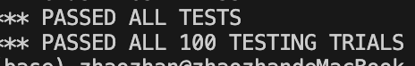

# Lab1

```shell
go build -race -buildmode=plugin ../mrapps/wc.go 
```

build 时候警告

```shell
ld: warning: '/private/var/folders/yn/my4xqj9x2p5f7d3tmjmz51km0000gn/T/go-link-1577169792/000000.o' has malformed LC_DYSYMTAB, expected 98 undefined symbols to start at index 1626, found 95 undefined symbols starting at index 1626
```

**这只是警告而已，不影响build的正确性**。

这个警告和`-race`选项相关，`-race`会向代码里插入检测代码，来检测多线程是否会发生竞争条件

```shell
-buildmode=plugin
```

用于将 Go 代码编译成动态链接库（在不同操作系统下表现形式有所不同，例如在 Linux 下是`.so`文件，在 Windows 下是`.dll`文件，在 macOS 下是`.dylib`文件等），使得这些代码可以在其他 Go 程序运行时被动态加载和使用，就像插件一样，为程序提供了一种灵活的扩展机制。

## WordCount

课程中对于 WC 的拆分值得思考

map 阶段仅仅将文件中的单词分离出来，以<word, '1'> 的方式写出，为什么不在 map 阶段就进行计数呢？原因有下

1. mapreduce 从设计思想上来说，map 阶段是 IO 密集型的，reduce 阶段是计算密集型的。
2. map 阶段计数的话，就要在内存中计数（hashmap），可能会导致内存不够
3. 如果在 map 阶段计数，则产生了节点状态，有状态的情况下崩溃恢复会变得复杂，而且 mapreduce 遵循无状态原则

## 核心思路：

worker循环找master要任务，做任务

master管理任务

master不去主动监测worker故障，只是在需要分配任务的时候检查正在执行中的任务是否有超时的，有超时的则视为做该任务的worker故障了，并将其所有任务分给其他worker

## 测试结果：

测试了100次，通过100次


